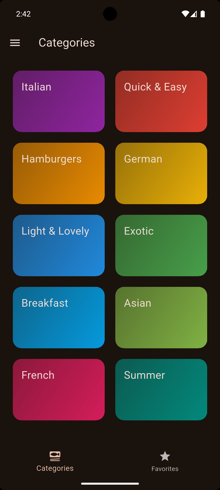
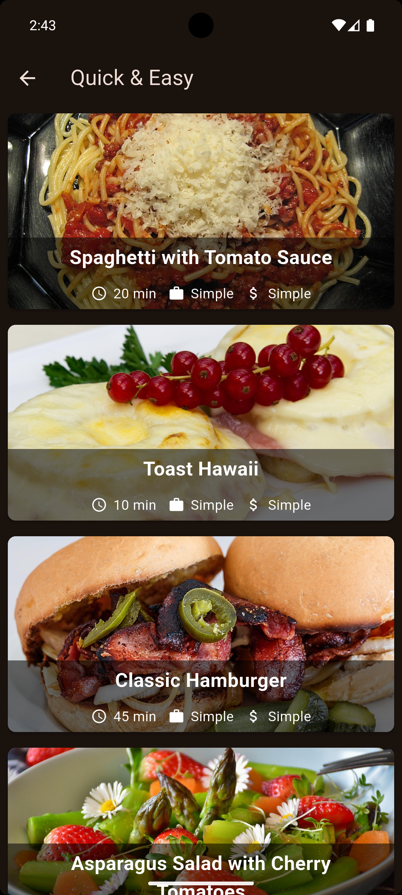
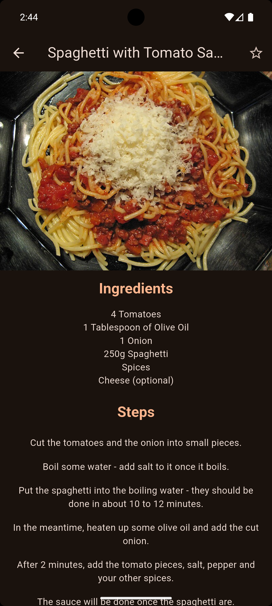
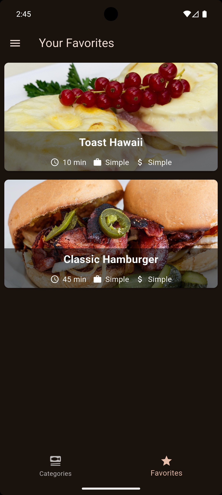
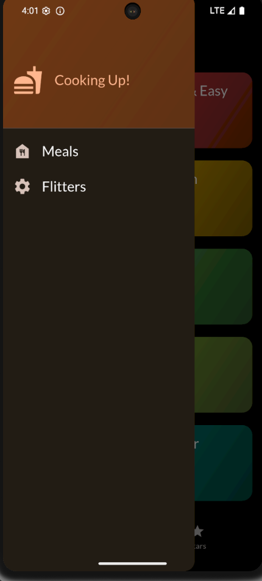
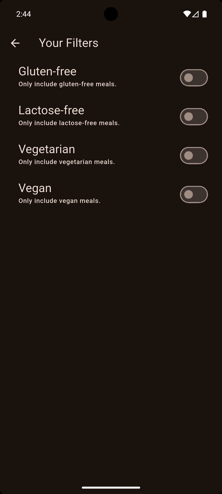

# 🍽️ Flutter Meals App

A simple Flutter application that displays meal **categories** and **meals** using **predefined (dummy) data**. The app demonstrates clean UI structure, basic **animations**, and state management using **Provider**.

---

## ✨ Features

* 📂 Meal Categories
* 🍔 Meals list per category
* 📄 Meal details screen
* ❤️ Add / remove favorite meals
* 🔍 Filter meals (e.g. gluten‑free, vegan, etc.)
* 🎞️ Simple animations (Hero & transitions)
* 🧠 State management with `Provider`

---

## 📸 App Screenshots (Mobile)

  
  
  
  
  
  

---

## 🛠️ Built With

* **Flutter**
* **Dart**
* **Provider** (state management)

---

## 📌 Notes

* All meals and categories are loaded from **predefined dummy data**.

---
